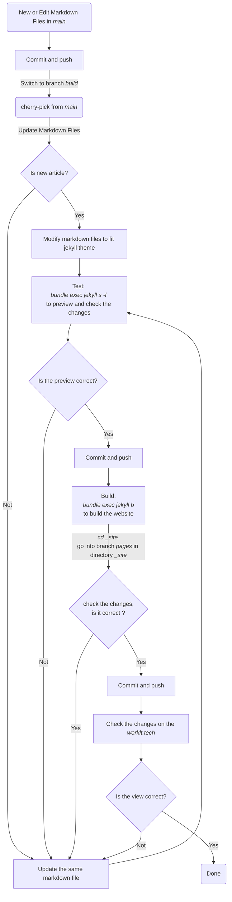

# [clips.qilove.store](https://clips.qilove.store)

Clips from online sources. Qilove arranged them to store in this website.

## Workflow（Start from branch `main`）
> - branch `main`: New and edit Markdown files content branch.
> - branch `build`: Your Jekyll theme or others generator code branch.
> - branch `pages`: Generated original website results.

